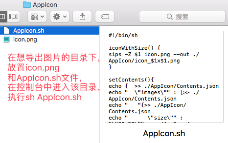
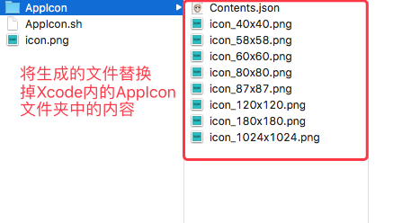
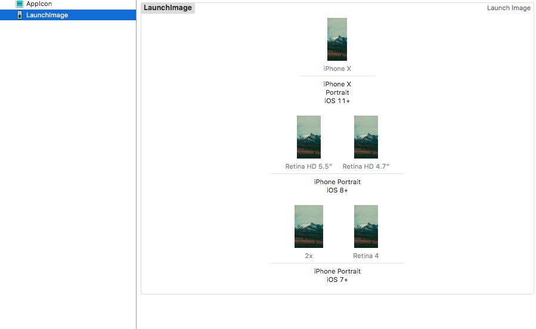

## 概述
之前用的一个批量导出APP图标和启动图的软件，今天发现收费了，于是自己造了个简单的轮子。

## 实现
Mac上的`sips`命令，可以很方便的帮助用户修改图片尺寸

Xcode里面的APP启动图资源包含两部分
1. 图片资源
2. 描述文件

所以这个脚本的功能就是两个
1. 生成描述文件`Contents.json`
2. 修改图片尺寸并关联描述文件

### 生成描述文件
使用`cat`命令生成描述文件

```
setContents(){
cat <<EOF >./AppIcon/Contents.json
{  
    "images" : [
    {
      "size" : "20x20",
      "idiom" : "iphone",
      "scale" : "2x",
      "filename" : "icon_40x40.png"
    },
    {
      "size" : "20x20",
      "idiom" : "iphone",
      "scale" : "3x",
      "filename" : "icon_60x60.png"
    },
    ...
EOF
}
```

### 修改图片尺寸
```
iconWithSize() {
sips -Z $1 icon.png --out ./AppIcon/icon_$1x$1.png
}
```

### 函数调用
```
mkdir AppIcon
setContents
for size in  40 58 60 80 87 120 180 1024
do
iconWithSize $size
done
```





## 效果展示




## 怎么使用
### AppIcon
下载对应的`sh`文件，放到你想导出图片的目录下，将你的原图命名为`icon.png`，然后在控制台中进入该目录，执行
```
sh AppIcon.sh
```

### LaunchImage
下载对应的`sh`文件，放到你想导出图片的目录下，将你的原图命名为`default.png`，然后在控制台中进入该目录，执行
```
sh AppLaunch.sh
```

就可以得到你要的资源啦。

## 更新日志
### 2019-04-28
更新生成`XR`和`XS Max`的启动图
### 2018-08-07 
更新代码，使用`cat`命令替换`echo`生成Contents.json文件  
感谢[@LinMaris](https://github.com/LinMaris)提供的思路

### 2018-06-24
更新`iPad`图标支持
